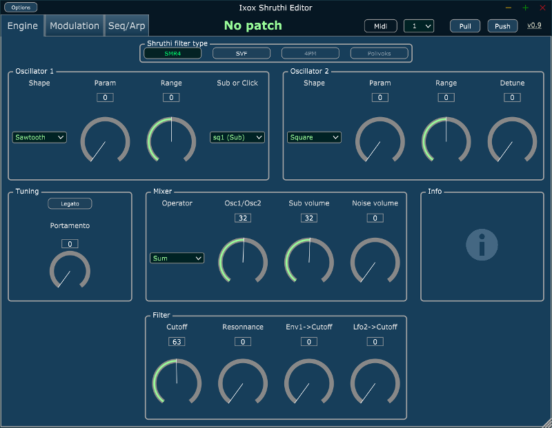
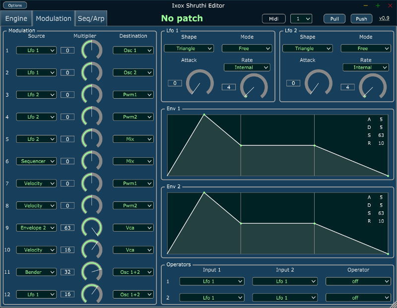
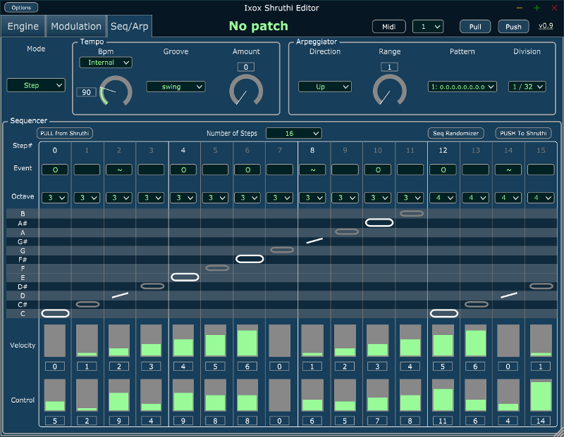

# Shruthi software editor

Here is the github repository the Ixox Shruthi Editor.  
 
This is a software editor for mac and windows. It's available as a standalone editor or a plugin (VST/AU). 
It's using the very nice [JUCE library](https://www.juce.com/discover).

And it looks like this : 
 
 
 
 
Binaries are available in the Releases area, <a href="https://github.com/Ixox/shruthiEditor/releases">here</a>. 
 
Xavier Hosxe
