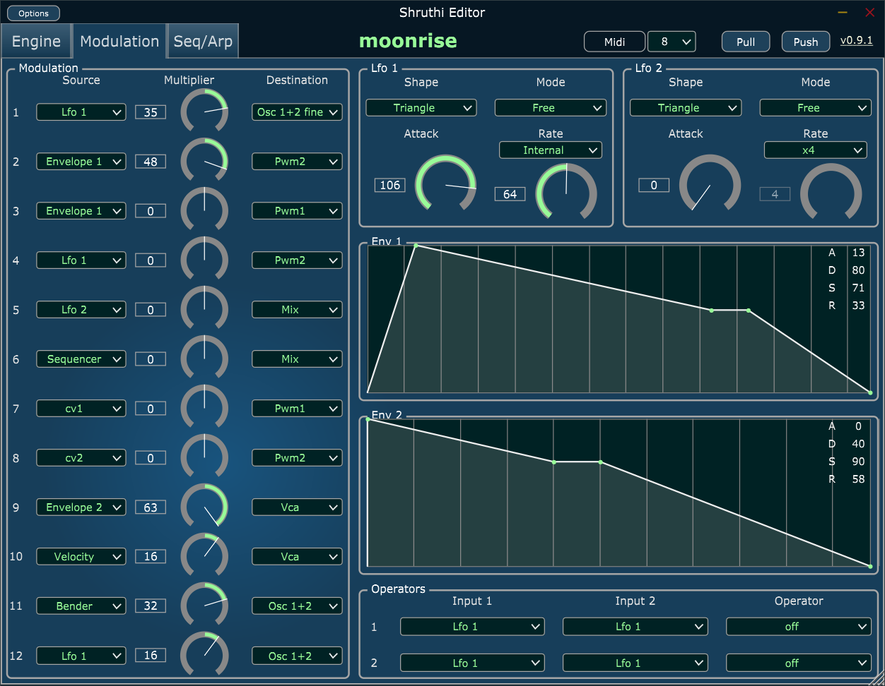

# Ambika & Shruthi Ixox Editors

Here is the github repository of the Ixox Shruthi Editor.  
I used the very nice [JUCE library](https://www.juce.com/discover) to develop them. 
Binaries are available in the Releases area, <a href="https://github.com/Ixox/Shruthi-And-Ambika-Editors/releases">here</a>. 
They are open source and free to use.
  

You'll find binaries for both mac (10.7+) and windows (win32 and x64). They're available as standalone editors and as a plugins (VST and AU). 
A big advantage of those editors is that they talk directly to your synth, so they are very easy to setup and should work with all DAWs (yes NRPN will reach your shruthi/Ambioka even with ableton live).  
I also hope you'll enjoy the resizable clean interface and the ease of use.   
The midi device you select in the plugin must not be used by your DAW. If you don't follow this rules, the plugin won't be able to open it. 
The plugins keep in sync the 3 following references : 
* The DAW for automation
* The shruthi/ambika itself
* The plugin UI 

Each modification you make in one of the 3 is propagated to the 2 others. 

Once you have a preset you like, just press the PULL button to retrieve the current preset. After that you can start use the automation in your DAW for any parameter or just modify the preset with the plugin UI. (Pull/Push for the sequencer is independant from the main one, same thing for the ambika multi part data). 
The states of the UI is saved with your song, and next time you'll load it, you'll retrieve the exact same sounds. You don't even need to save the preset on your Shruthi Eprom/ Ambika sdcard. 
For Ambika you can open as many plugins instances as number of parts you use. Don't have more than 1 controlling the multi part tab.  
The plugins support several shruthi or ambika machines, just select the correct midi device for the one you want to talk to. 
 
If you use the standalone version, select the keyboard you want to use in the top left "option" menu, midi events will be forwarded to your synth, the correct midi channel will be set on the way. 
 
Please report all bugs you find,  
Thanks 
Xavier Hosxe   

# Shruthi screenshots

<table><tr>
<td>
 
</td><td>
 
</td></table>
<table><tr>
<td>
 
</td>
</table>
 

# Ambika screenshots

<table><tr>
<td>
 
</td><td>
 
</td></table>
<table><tr>
<td>
 
</td><td>
 
</td></table>
 

